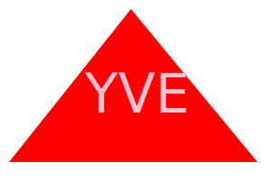
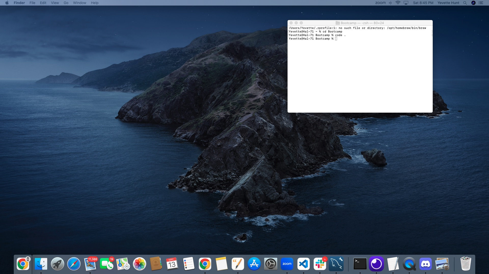

# 10 dont-be-a-square-logo-maker

## Description

This is a nifty little app that runs as a Node.js command-line application. It takes in user input to generate a logo and save it as an SVG file. The application prompts the user to select a color and shape, provide text for the logo, and save the generated SVG to a `.svg` file. 




<details> 
<summary>SVG code</summary>

```
@sample.svg
<svg version="1.1" width="300" height="200" xmlns="http://www.w3.org/2000/svg">Triangle<polygon points="145,10 285,180 10,180" fill="red"/><text x="150" y="125" font-size="60" text-anchor="middle" fill="pink">YVE</text></svg>
@sample.svg
```

</details>




## Installation:

To initialize this application, install Node.js and navigate to the project directory in your terminal. In your command prompt run the command node index.js. Follow the prompts and find your custom svg file in your project directory after completion. You can the open the file in your browser to see your rendered logo.

## License:

[](https://opensource.org/licenses/MIT)

## Contact:

If you would like additional information, please contact Yevette Hunt
My GitHub username is yveivy

https://github.com/yveivy/dont-be-a-square-logo-maker/blob/main/demo-dont-be-a-square-logo-maker.webm